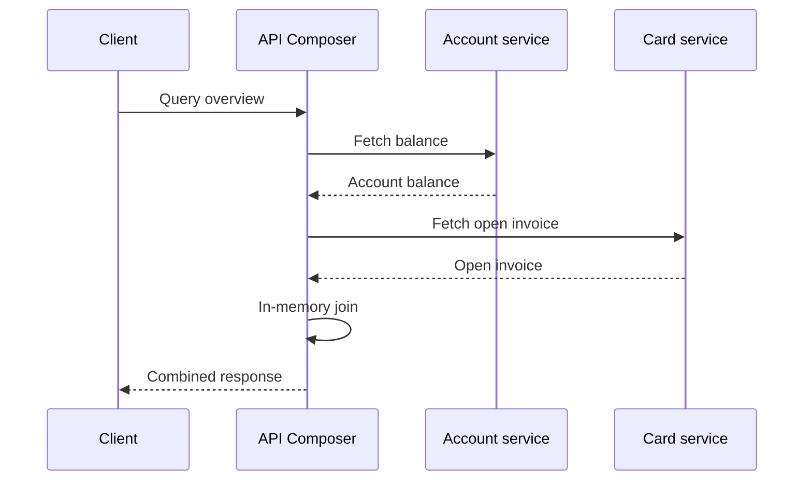

```mermaid
sequenceDiagram
    participant C as Client
    participant A as API Composer
    participant ACC as Account service
    participant CS as Card service
    C->>A: Query overview
    A->>ACC: Fetch balance
    ACC-->>A: Account balance
    A->>CS: Fetch open invoice
    CS-->>A: Open invoice
    A->>A: In-memory join
    A-->>C: Combined response
```
