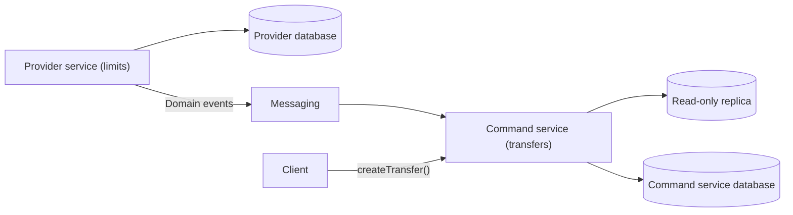

```mermaid
flowchart LR
    P["Provider service (limits)"] --> PDB[("Provider database")]
    P -->|"Domain events"| B["Messaging"]
    B --> C["Command service (transfers)"]
    C --> R[("Read-only replica")]
    C --> CDB[("Command service database")]
    CL["Client"] -->|"createTransfer()"| C
```
