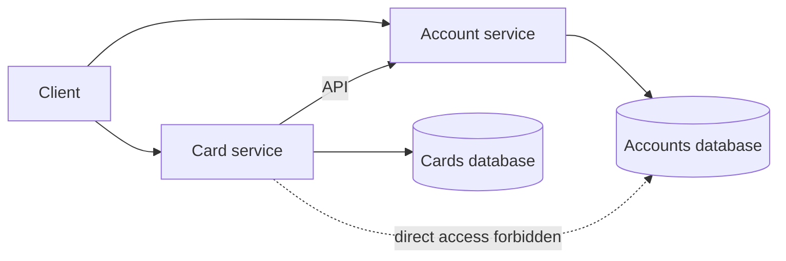

```mermaid
flowchart LR
    C["Client"] --> ACC["Account service"]
    C --> CS["Card service"]
    ACC --> ADB[("Accounts database")]
    CS --> CDB[("Cards database")]
    CS -->|"API"| ACC
    CS -.->|"direct access forbidden"| ADB
```
