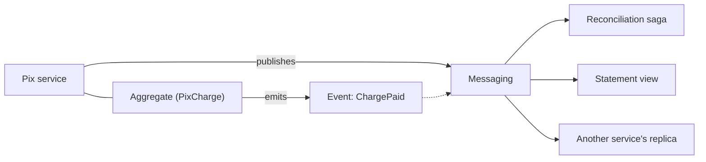

```mermaid
flowchart LR
    A["Aggregate (PixCharge)"] -->|"emits"| E["Event: ChargePaid"]
    S["Pix service"] --- A
    S -->|"publishes"| B["Messaging"]
    E -.-> B
    B --> C1["Reconciliation saga"]
    B --> C2["Statement view"]
    B --> C3["Another service's replica"]
```
