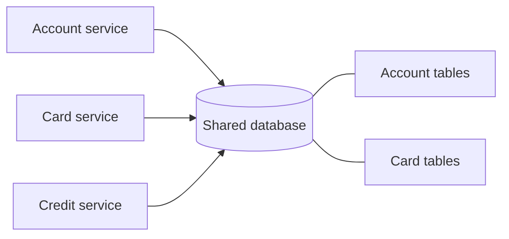

```mermaid
flowchart LR
    ACC["Account service"] --> DB[("Shared database")]
    CS["Card service"] --> DB
    LS["Credit service"] --> DB
    DB --- T1["Account tables"]
    DB --- T2["Card tables"]
```
