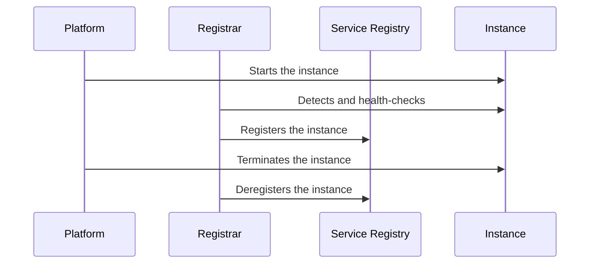

```mermaid
sequenceDiagram
    participant P as Platform
    participant G as Registrar
    participant R as Service Registry
    participant I as Instance
    P->>I: Starts the instance
    G->>I: Detects and health-checks
    G->>R: Registers the instance
    P->>I: Terminates the instance
    G->>R: Deregisters the instance
```
