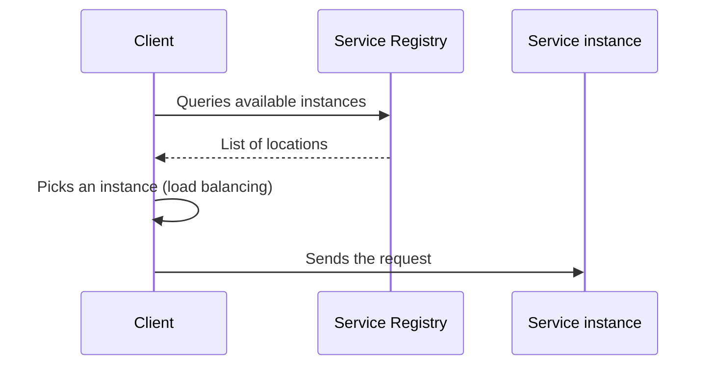

```mermaid
sequenceDiagram
    participant C as Client
    participant R as Service Registry
    participant I as Service instance
    C->>R: Queries available instances
    R-->>C: List of locations
    C->>C: Picks an instance (load balancing)
    C->>I: Sends the request
```
