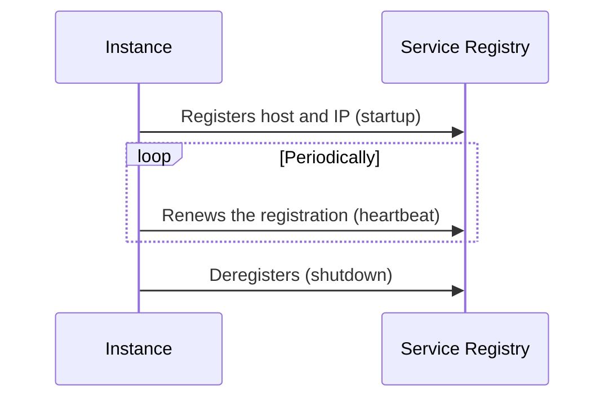

```mermaid
sequenceDiagram
    participant I as Instance
    participant R as Service Registry
    I->>R: Registers host and IP (startup)
    loop Periodically
        I->>R: Renews the registration (heartbeat)
    end
    I->>R: Deregisters (shutdown)
```
