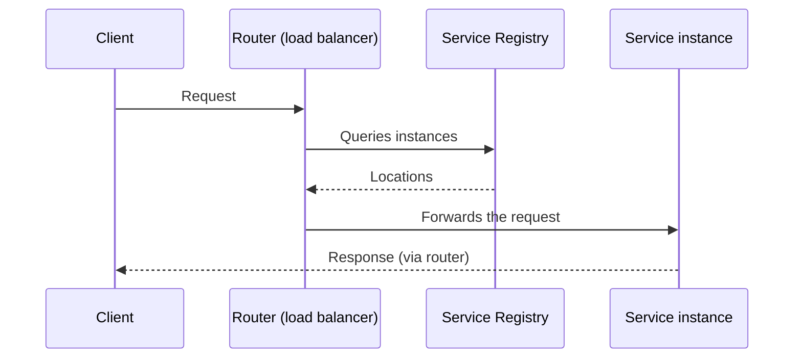

```mermaid
sequenceDiagram
    participant C as Client
    participant L as Router (load balancer)
    participant R as Service Registry
    participant I as Service instance
    C->>L: Request
    L->>R: Queries instances
    R-->>L: Locations
    L->>I: Forwards the request
    I-->>C: Response (via router)
```
