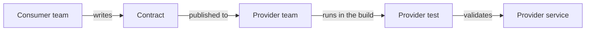

```mermaid
flowchart LR
    C["Consumer team"] -->|"writes"| K["Contract"]
    K -->|"published to"| P["Provider team"]
    P -->|"runs in the build"| T["Provider test"]
    T -->|"validates"| S["Provider service"]
```
