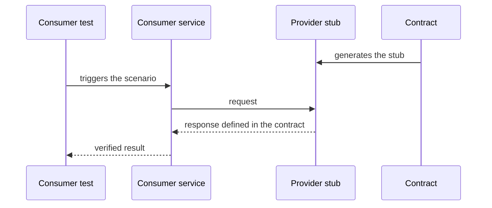

```mermaid
sequenceDiagram
    participant T as Consumer test
    participant C as Consumer service
    participant S as Provider stub
    participant K as Contract
    K->>S: generates the stub
    T->>C: triggers the scenario
    C->>S: request
    S-->>C: response defined in the contract
    C-->>T: verified result
```
