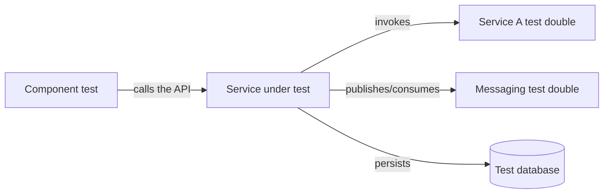

```mermaid
flowchart LR
    T["Component test"] -->|"calls the API"| S["Service under test"]
    S -->|"invokes"| D1["Service A test double"]
    S -->|"publishes/consumes"| D2["Messaging test double"]
    S -->|"persists"| B[("Test database")]
```
