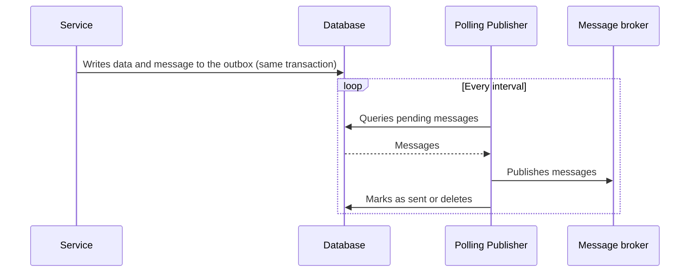

```mermaid
sequenceDiagram
    participant S as Service
    participant DB as Database
    participant P as Polling Publisher
    participant B as Message broker
    S->>DB: Writes data and message to the outbox (same transaction)
    loop Every interval
        P->>DB: Queries pending messages
        DB-->>P: Messages
        P->>B: Publishes messages
        P->>DB: Marks as sent or deletes
    end
```
