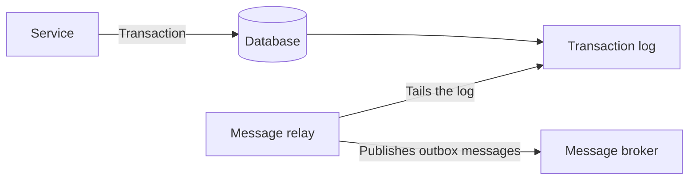

```mermaid
flowchart LR
    S["Service"] -->|"Transaction"| DB[("Database")]
    DB --> L["Transaction log"]
    R["Message relay"] -->|"Tails the log"| L
    R -->|"Publishes outbox messages"| B["Message broker"]
```
