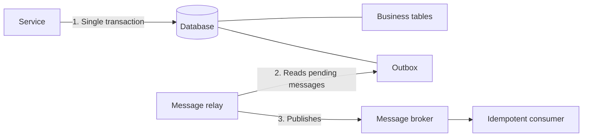

```mermaid
flowchart LR
    S["Service"] -->|"1. Single transaction"| DB[("Database")]
    DB --- T["Business tables"]
    DB --- O["Outbox"]
    R["Message relay"] -->|"2. Reads pending messages"| O
    R -->|"3. Publishes"| B["Message broker"]
    B --> C["Idempotent consumer"]
```
