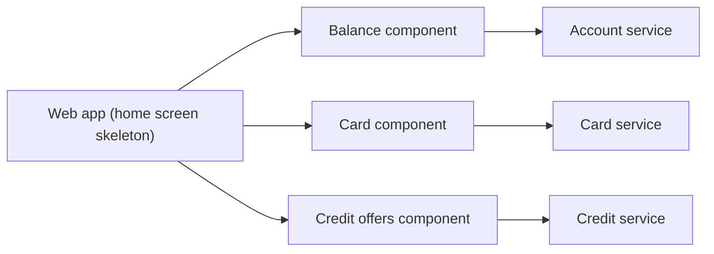

```mermaid
flowchart LR
    N["Web app (home screen skeleton)"] --> C1[Balance component]
    N --> C2[Card component]
    N --> C3[Credit offers component]
    C1 --> S1[Account service]
    C2 --> S2[Card service]
    C3 --> S3[Credit service]
```
