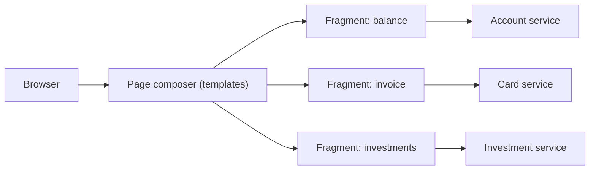

```mermaid
flowchart LR
    N[Browser] --> P["Page composer (templates)"]
    P --> F1["Fragment: balance"]
    P --> F2["Fragment: invoice"]
    P --> F3["Fragment: investments"]
    F1 --> S1[Account service]
    F2 --> S2[Card service]
    F3 --> S3[Investment service]
```
