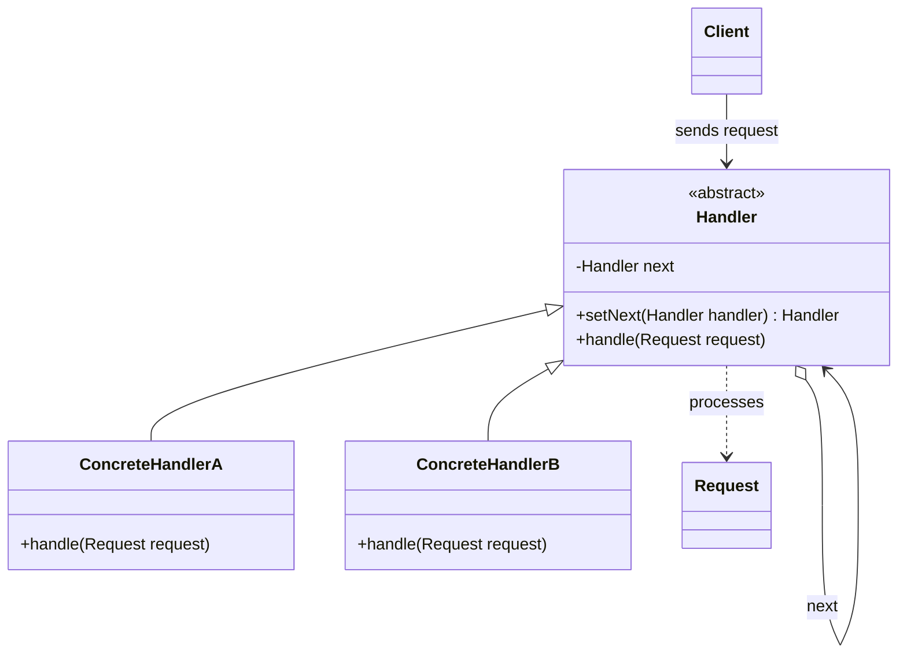

```mermaid
classDiagram
    class Client
    class Handler {
        <<abstract>>
        -Handler next
        +setNext(Handler handler) Handler
        +handle(Request request)
    }
    class ConcreteHandlerA {
        +handle(Request request)
    }
    class ConcreteHandlerB {
        +handle(Request request)
    }
    class Request
    Client --> Handler : sends request
    Handler o--> Handler : next
    Handler <|-- ConcreteHandlerA
    Handler <|-- ConcreteHandlerB
    Handler ..> Request : processes
```
