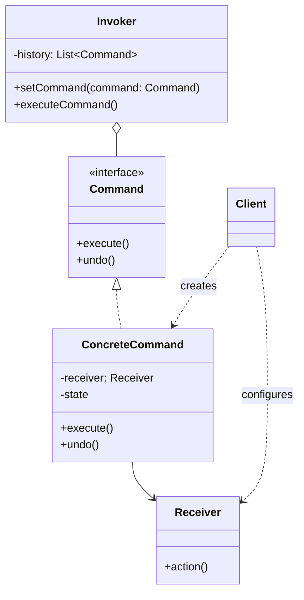

```mermaid
classDiagram
    class Command {
        <<interface>>
        +execute()
        +undo()
    }
    class ConcreteCommand {
        -receiver: Receiver
        -state
        +execute()
        +undo()
    }
    class Receiver {
        +action()
    }
    class Invoker {
        -history: List~Command~
        +setCommand(command: Command)
        +executeCommand()
    }
    class Client
    Command <|.. ConcreteCommand
    ConcreteCommand --> Receiver
    Invoker o-- Command
    Client ..> ConcreteCommand : creates
    Client ..> Receiver : configures
```
