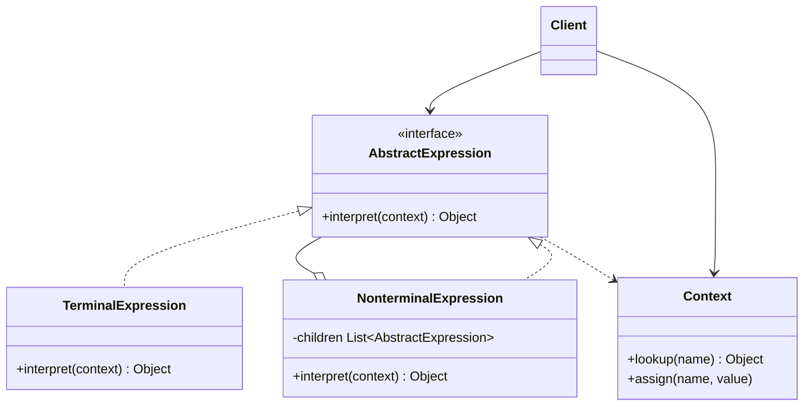

```mermaid
classDiagram
    class Client
    class Context {
        +lookup(name) Object
        +assign(name, value)
    }
    class AbstractExpression {
        <<interface>>
        +interpret(context) Object
    }
    class TerminalExpression {
        +interpret(context) Object
    }
    class NonterminalExpression {
        -children List~AbstractExpression~
        +interpret(context) Object
    }
    Client --> AbstractExpression
    Client --> Context
    AbstractExpression <|.. TerminalExpression
    AbstractExpression <|.. NonterminalExpression
    NonterminalExpression o-- AbstractExpression
    AbstractExpression ..> Context
```
