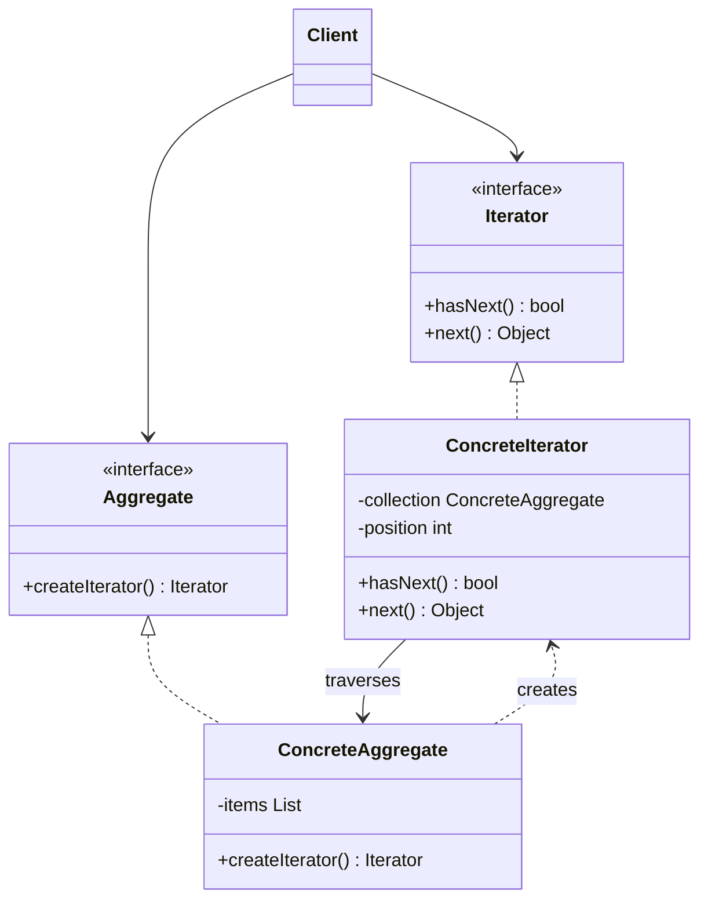

```mermaid
classDiagram
    class Iterator {
        <<interface>>
        +hasNext() bool
        +next() Object
    }
    class Aggregate {
        <<interface>>
        +createIterator() Iterator
    }
    class ConcreteIterator {
        -collection ConcreteAggregate
        -position int
        +hasNext() bool
        +next() Object
    }
    class ConcreteAggregate {
        -items List
        +createIterator() Iterator
    }
    class Client
    Iterator <|.. ConcreteIterator
    Aggregate <|.. ConcreteAggregate
    ConcreteAggregate ..> ConcreteIterator : creates
    ConcreteIterator --> ConcreteAggregate : traverses
    Client --> Aggregate
    Client --> Iterator
```
