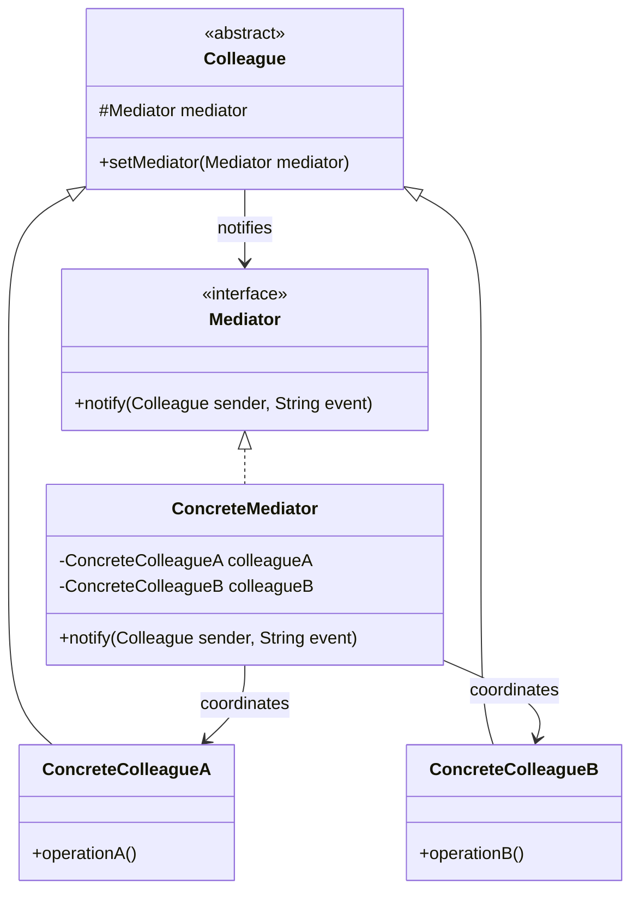

```mermaid
classDiagram
    class Mediator {
        <<interface>>
        +notify(Colleague sender, String event)
    }
    class ConcreteMediator {
        -ConcreteColleagueA colleagueA
        -ConcreteColleagueB colleagueB
        +notify(Colleague sender, String event)
    }
    class Colleague {
        <<abstract>>
        #Mediator mediator
        +setMediator(Mediator mediator)
    }
    class ConcreteColleagueA {
        +operationA()
    }
    class ConcreteColleagueB {
        +operationB()
    }
    Mediator <|.. ConcreteMediator
    Colleague <|-- ConcreteColleagueA
    Colleague <|-- ConcreteColleagueB
    Colleague --> Mediator : notifies
    ConcreteMediator --> ConcreteColleagueA : coordinates
    ConcreteMediator --> ConcreteColleagueB : coordinates
```
