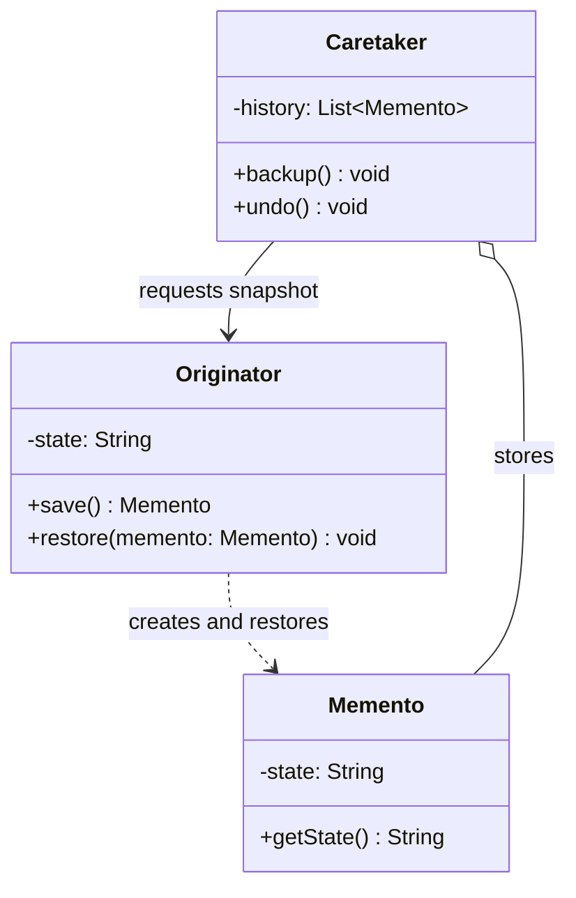

```mermaid
classDiagram
    class Originator {
        -state: String
        +save() Memento
        +restore(memento: Memento) void
    }
    class Memento {
        -state: String
        +getState() String
    }
    class Caretaker {
        -history: List~Memento~
        +backup() void
        +undo() void
    }
    Originator ..> Memento : creates and restores
    Caretaker o-- Memento : stores
    Caretaker --> Originator : requests snapshot
```
