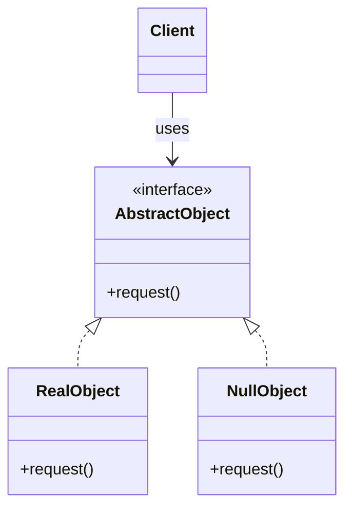

```mermaid
classDiagram
    class Client
    class AbstractObject {
        <<interface>>
        +request()
    }
    class RealObject {
        +request()
    }
    class NullObject {
        +request()
    }
    Client --> AbstractObject : uses
    AbstractObject <|.. RealObject
    AbstractObject <|.. NullObject
```
