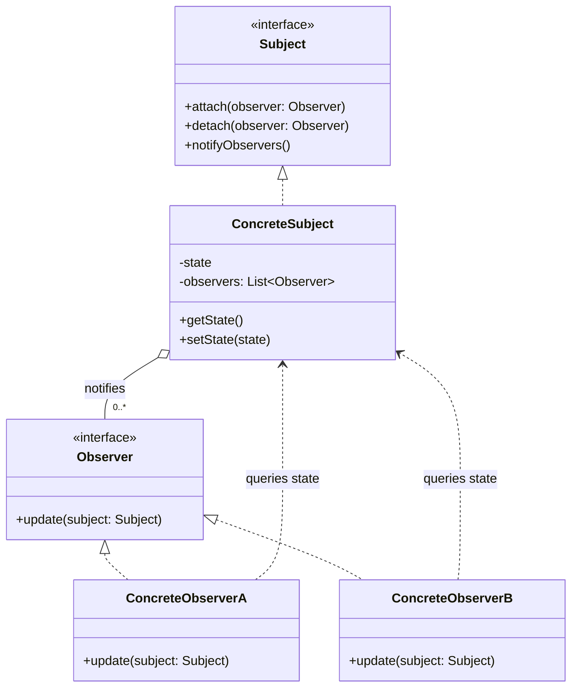

```mermaid
classDiagram
    class Subject {
        <<interface>>
        +attach(observer: Observer)
        +detach(observer: Observer)
        +notifyObservers()
    }
    class ConcreteSubject {
        -state
        -observers: List~Observer~
        +getState()
        +setState(state)
    }
    class Observer {
        <<interface>>
        +update(subject: Subject)
    }
    class ConcreteObserverA {
        +update(subject: Subject)
    }
    class ConcreteObserverB {
        +update(subject: Subject)
    }
    Subject <|.. ConcreteSubject
    Observer <|.. ConcreteObserverA
    Observer <|.. ConcreteObserverB
    ConcreteSubject o-- "0..*" Observer : notifies
    ConcreteObserverA ..> ConcreteSubject : queries state
    ConcreteObserverB ..> ConcreteSubject : queries state
```
