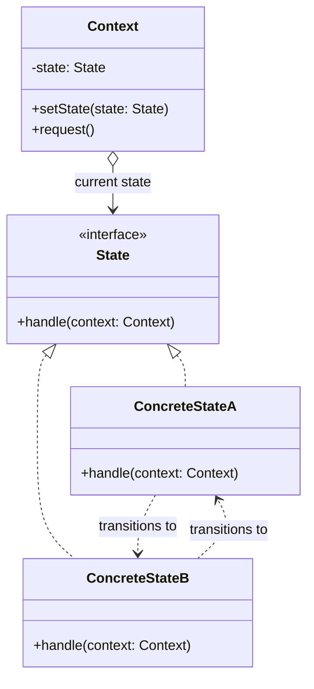

```mermaid
classDiagram
    class Context {
        -state: State
        +setState(state: State)
        +request()
    }
    class State {
        <<interface>>
        +handle(context: Context)
    }
    class ConcreteStateA {
        +handle(context: Context)
    }
    class ConcreteStateB {
        +handle(context: Context)
    }
    Context o--> State : current state
    State <|.. ConcreteStateA
    State <|.. ConcreteStateB
    ConcreteStateA ..> ConcreteStateB : transitions to
    ConcreteStateB ..> ConcreteStateA : transitions to
```
