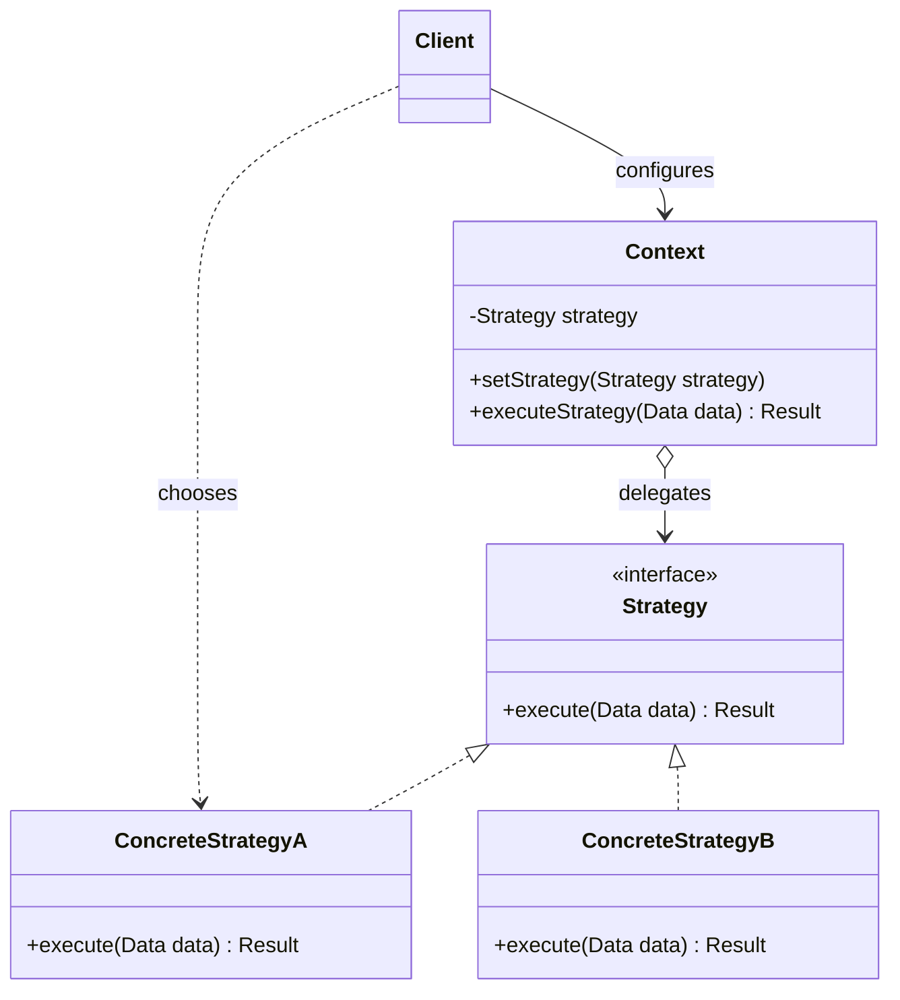

```mermaid
classDiagram
    class Client
    class Context {
        -Strategy strategy
        +setStrategy(Strategy strategy)
        +executeStrategy(Data data) Result
    }
    class Strategy {
        <<interface>>
        +execute(Data data) Result
    }
    class ConcreteStrategyA {
        +execute(Data data) Result
    }
    class ConcreteStrategyB {
        +execute(Data data) Result
    }
    Client --> Context : configures
    Client ..> ConcreteStrategyA : chooses
    Context o--> Strategy : delegates
    Strategy <|.. ConcreteStrategyA
    Strategy <|.. ConcreteStrategyB
```
