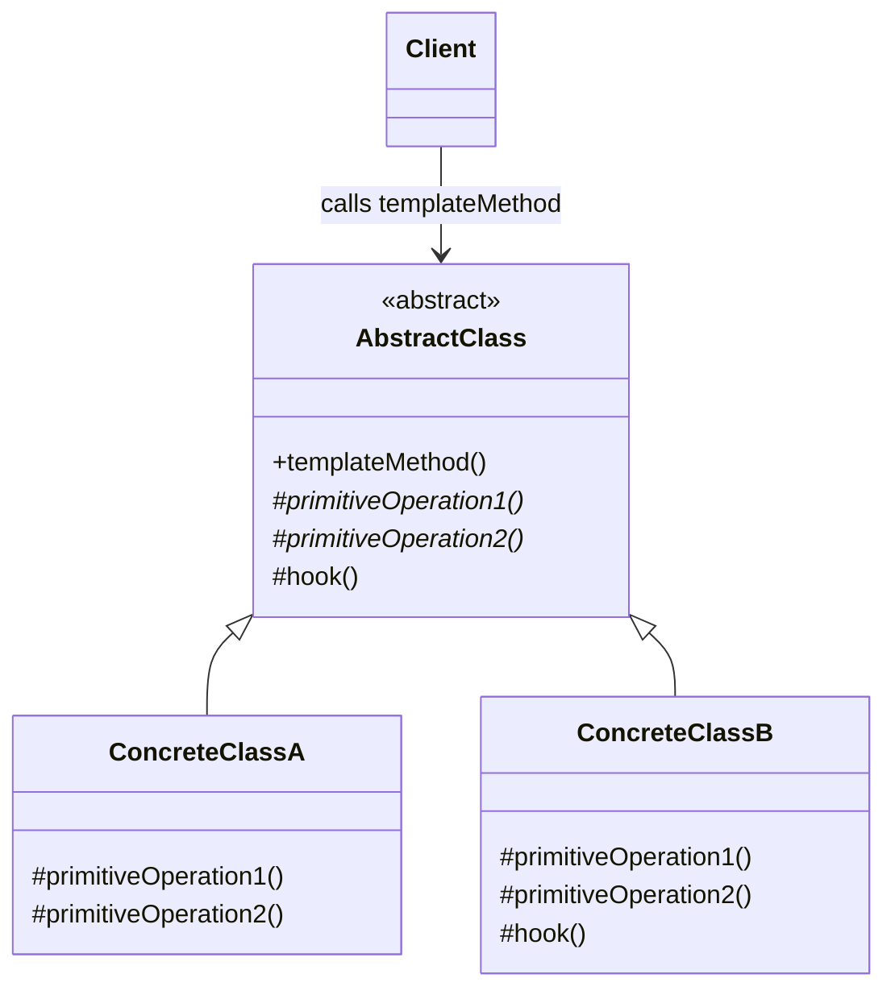

```mermaid
classDiagram
    class AbstractClass {
        <<abstract>>
        +templateMethod()
        #primitiveOperation1()*
        #primitiveOperation2()*
        #hook()
    }
    class ConcreteClassA {
        #primitiveOperation1()
        #primitiveOperation2()
    }
    class ConcreteClassB {
        #primitiveOperation1()
        #primitiveOperation2()
        #hook()
    }
    class Client
    AbstractClass <|-- ConcreteClassA
    AbstractClass <|-- ConcreteClassB
    Client --> AbstractClass : calls templateMethod
```
