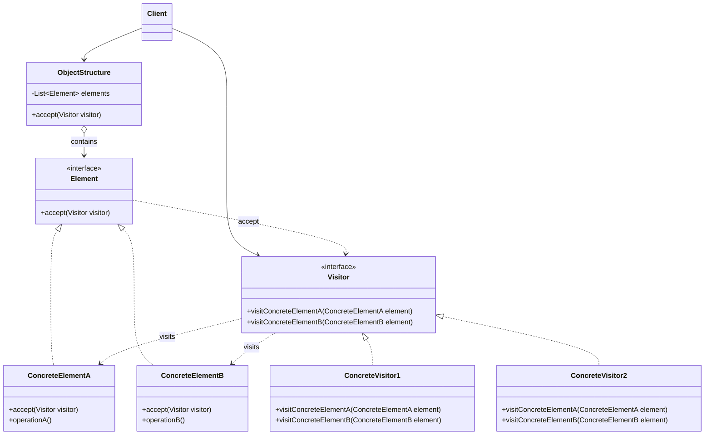

```mermaid
classDiagram
    class Client
    class ObjectStructure {
        -List~Element~ elements
        +accept(Visitor visitor)
    }
    class Visitor {
        <<interface>>
        +visitConcreteElementA(ConcreteElementA element)
        +visitConcreteElementB(ConcreteElementB element)
    }
    class ConcreteVisitor1 {
        +visitConcreteElementA(ConcreteElementA element)
        +visitConcreteElementB(ConcreteElementB element)
    }
    class ConcreteVisitor2 {
        +visitConcreteElementA(ConcreteElementA element)
        +visitConcreteElementB(ConcreteElementB element)
    }
    class Element {
        <<interface>>
        +accept(Visitor visitor)
    }
    class ConcreteElementA {
        +accept(Visitor visitor)
        +operationA()
    }
    class ConcreteElementB {
        +accept(Visitor visitor)
        +operationB()
    }
    Client --> ObjectStructure
    Client --> Visitor
    ObjectStructure o--> Element : contains
    Visitor <|.. ConcreteVisitor1
    Visitor <|.. ConcreteVisitor2
    Element <|.. ConcreteElementA
    Element <|.. ConcreteElementB
    Element ..> Visitor : accept
    Visitor ..> ConcreteElementA : visits
    Visitor ..> ConcreteElementB : visits
```
