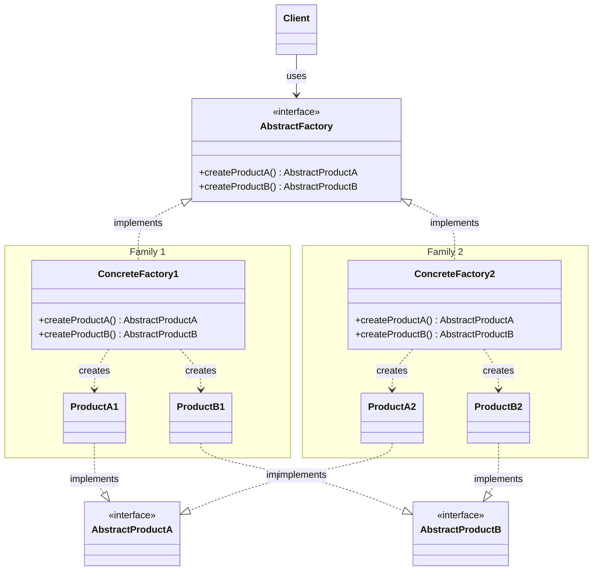

```mermaid
classDiagram
    class AbstractFactory {
        <<interface>>
        +createProductA() AbstractProductA
        +createProductB() AbstractProductB
    }
    namespace Family1["Family 1"] {
        class ConcreteFactory1 {
            +createProductA() AbstractProductA
            +createProductB() AbstractProductB
        }
        class ProductA1
        class ProductB1
    }
    namespace Family2["Family 2"] {
        class ConcreteFactory2 {
            +createProductA() AbstractProductA
            +createProductB() AbstractProductB
        }
        class ProductA2
        class ProductB2
    }
    class AbstractProductA {
        <<interface>>
    }
    class AbstractProductB {
        <<interface>>
    }

    Client --> AbstractFactory : uses
    AbstractFactory <|.. ConcreteFactory1 : implements
    AbstractFactory <|.. ConcreteFactory2 : implements
    ConcreteFactory1 ..> ProductA1 : creates
    ConcreteFactory1 ..> ProductB1 : creates
    ConcreteFactory2 ..> ProductA2 : creates
    ConcreteFactory2 ..> ProductB2 : creates
    ProductA1 ..|> AbstractProductA : implements
    ProductA2 ..|> AbstractProductA : implements
    ProductB1 ..|> AbstractProductB : implements
    ProductB2 ..|> AbstractProductB : implements
```
