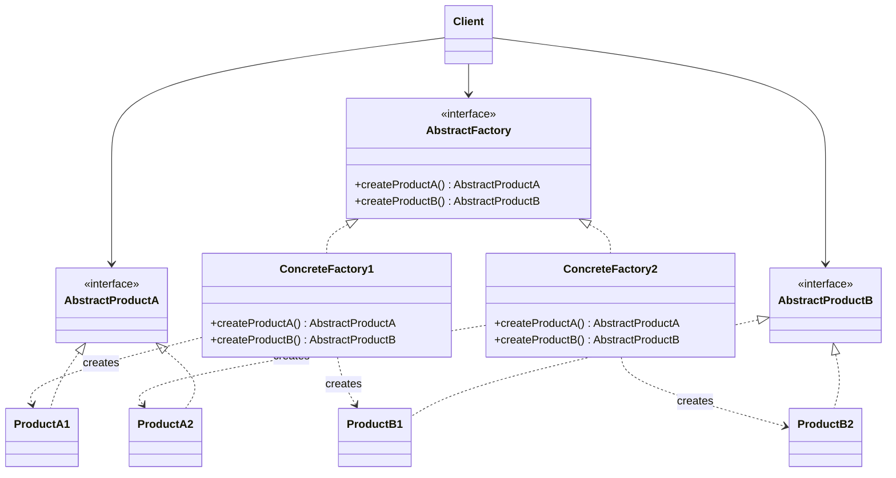

```mermaid
classDiagram
    class AbstractFactory {
        <<interface>>
        +createProductA() AbstractProductA
        +createProductB() AbstractProductB
    }
    class ConcreteFactory1 {
        +createProductA() AbstractProductA
        +createProductB() AbstractProductB
    }
    class ConcreteFactory2 {
        +createProductA() AbstractProductA
        +createProductB() AbstractProductB
    }
    class AbstractProductA {
        <<interface>>
    }
    class AbstractProductB {
        <<interface>>
    }
    class ProductA1
    class ProductA2
    class ProductB1
    class ProductB2
    class Client

    AbstractFactory <|.. ConcreteFactory1
    AbstractFactory <|.. ConcreteFactory2
    AbstractProductA <|.. ProductA1
    AbstractProductA <|.. ProductA2
    AbstractProductB <|.. ProductB1
    AbstractProductB <|.. ProductB2
    ConcreteFactory1 ..> ProductA1 : creates
    ConcreteFactory1 ..> ProductB1 : creates
    ConcreteFactory2 ..> ProductA2 : creates
    ConcreteFactory2 ..> ProductB2 : creates
    Client --> AbstractFactory
    Client --> AbstractProductA
    Client --> AbstractProductB
```
