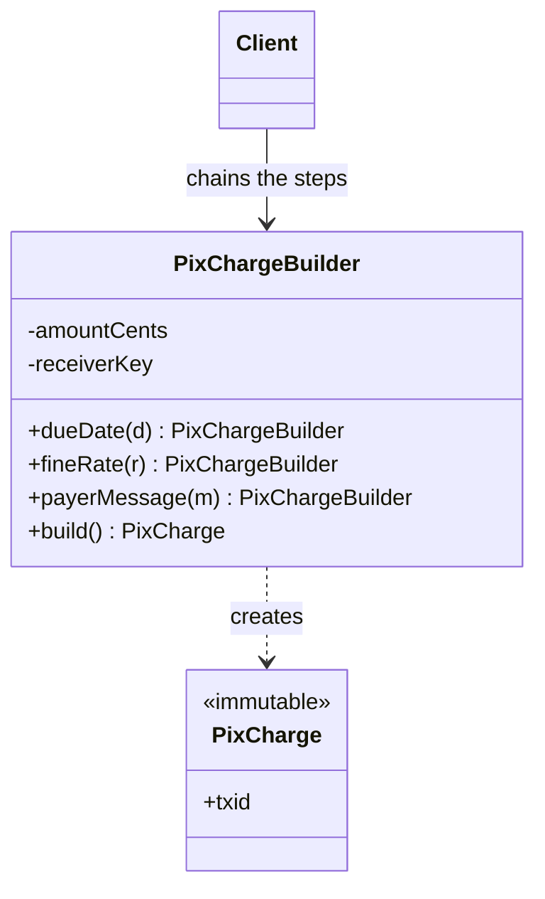

```mermaid
classDiagram
    class PixChargeBuilder {
        -amountCents
        -receiverKey
        +dueDate(d) PixChargeBuilder
        +fineRate(r) PixChargeBuilder
        +payerMessage(m) PixChargeBuilder
        +build() PixCharge
    }
    class PixCharge {
        <<immutable>>
        +txid
    }
    class Client
    Client --> PixChargeBuilder : chains the steps
    PixChargeBuilder ..> PixCharge : creates
```
