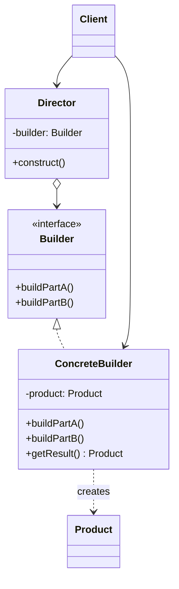

```mermaid
classDiagram
    class Director {
        -builder: Builder
        +construct()
    }
    class Builder {
        <<interface>>
        +buildPartA()
        +buildPartB()
    }
    class ConcreteBuilder {
        -product: Product
        +buildPartA()
        +buildPartB()
        +getResult() Product
    }
    class Product
    class Client
    Director o--> Builder
    Builder <|.. ConcreteBuilder
    ConcreteBuilder ..> Product : creates
    Client --> Director
    Client --> ConcreteBuilder
```
