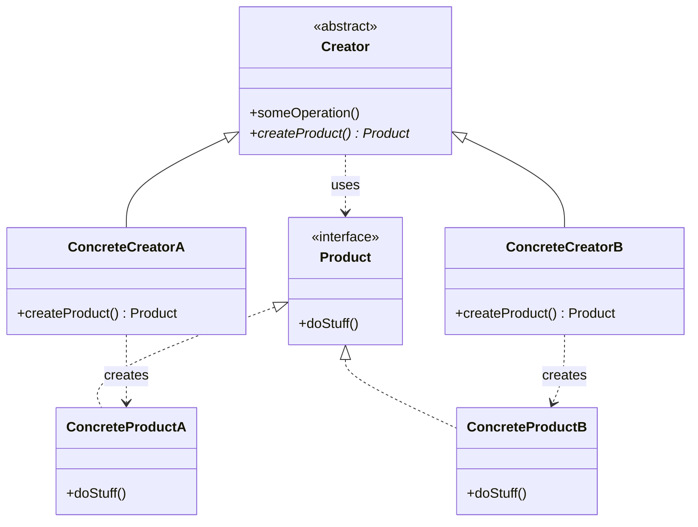

```mermaid
classDiagram
    class Creator {
        <<abstract>>
        +someOperation()
        +createProduct()* Product
    }
    class ConcreteCreatorA {
        +createProduct() Product
    }
    class ConcreteCreatorB {
        +createProduct() Product
    }
    class Product {
        <<interface>>
        +doStuff()
    }
    class ConcreteProductA {
        +doStuff()
    }
    class ConcreteProductB {
        +doStuff()
    }
    Creator <|-- ConcreteCreatorA
    Creator <|-- ConcreteCreatorB
    Product <|.. ConcreteProductA
    Product <|.. ConcreteProductB
    Creator ..> Product : uses
    ConcreteCreatorA ..> ConcreteProductA : creates
    ConcreteCreatorB ..> ConcreteProductB : creates
```
