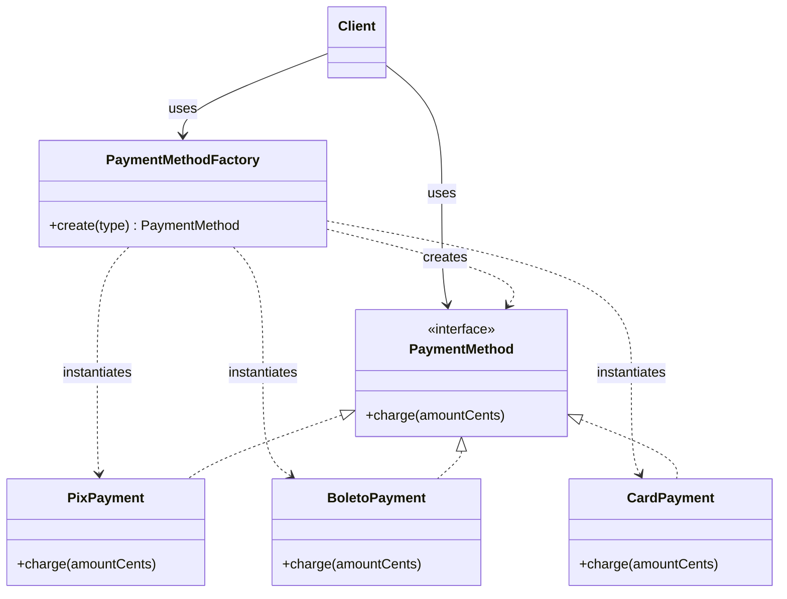

```mermaid
classDiagram
    class Client
    class PaymentMethodFactory {
        +create(type) PaymentMethod
    }
    class PaymentMethod {
        <<interface>>
        +charge(amountCents)
    }
    class PixPayment {
        +charge(amountCents)
    }
    class BoletoPayment {
        +charge(amountCents)
    }
    class CardPayment {
        +charge(amountCents)
    }
    Client --> PaymentMethodFactory : uses
    Client --> PaymentMethod : uses
    PaymentMethodFactory ..> PaymentMethod : creates
    PaymentMethodFactory ..> PixPayment : instantiates
    PaymentMethodFactory ..> BoletoPayment : instantiates
    PaymentMethodFactory ..> CardPayment : instantiates
    PaymentMethod <|.. PixPayment
    PaymentMethod <|.. BoletoPayment
    PaymentMethod <|.. CardPayment
```
