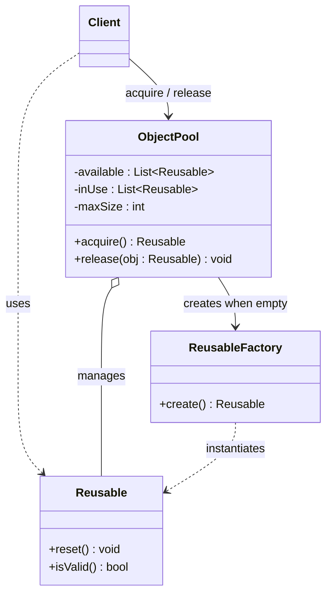

```mermaid
classDiagram
    class Client
    class ObjectPool {
        -available : List~Reusable~
        -inUse : List~Reusable~
        -maxSize : int
        +acquire() Reusable
        +release(obj : Reusable) void
    }
    class Reusable {
        +reset() void
        +isValid() bool
    }
    class ReusableFactory {
        +create() Reusable
    }
    Client --> ObjectPool : acquire / release
    Client ..> Reusable : uses
    ObjectPool o-- Reusable : manages
    ObjectPool --> ReusableFactory : creates when empty
    ReusableFactory ..> Reusable : instantiates
```
