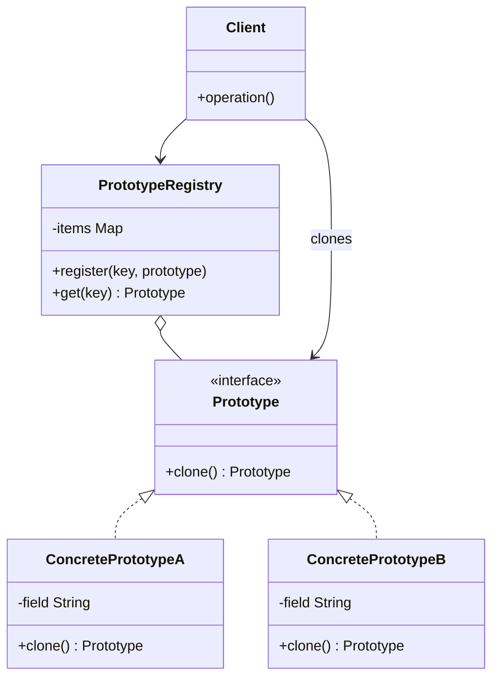

```mermaid
classDiagram
    class Prototype {
        <<interface>>
        +clone() Prototype
    }
    class ConcretePrototypeA {
        -field String
        +clone() Prototype
    }
    class ConcretePrototypeB {
        -field String
        +clone() Prototype
    }
    class PrototypeRegistry {
        -items Map
        +register(key, prototype)
        +get(key) Prototype
    }
    class Client {
        +operation()
    }
    Prototype <|.. ConcretePrototypeA
    Prototype <|.. ConcretePrototypeB
    PrototypeRegistry o-- Prototype
    Client --> Prototype : clones
    Client --> PrototypeRegistry
```
