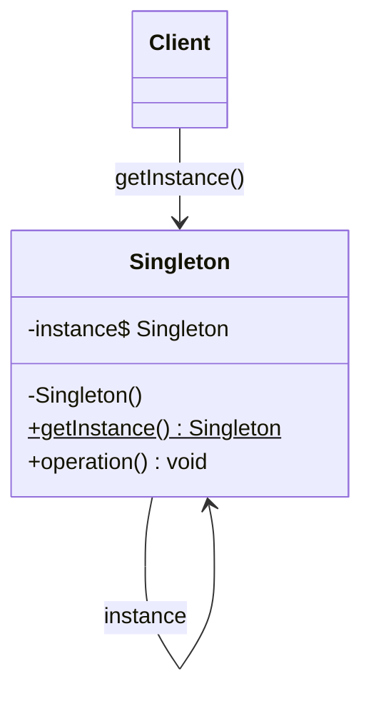

```mermaid
classDiagram
    class Singleton {
        -instance$ Singleton
        -Singleton()
        +getInstance()$ Singleton
        +operation() void
    }
    class Client
    Client --> Singleton : getInstance()
    Singleton --> Singleton : instance
```
