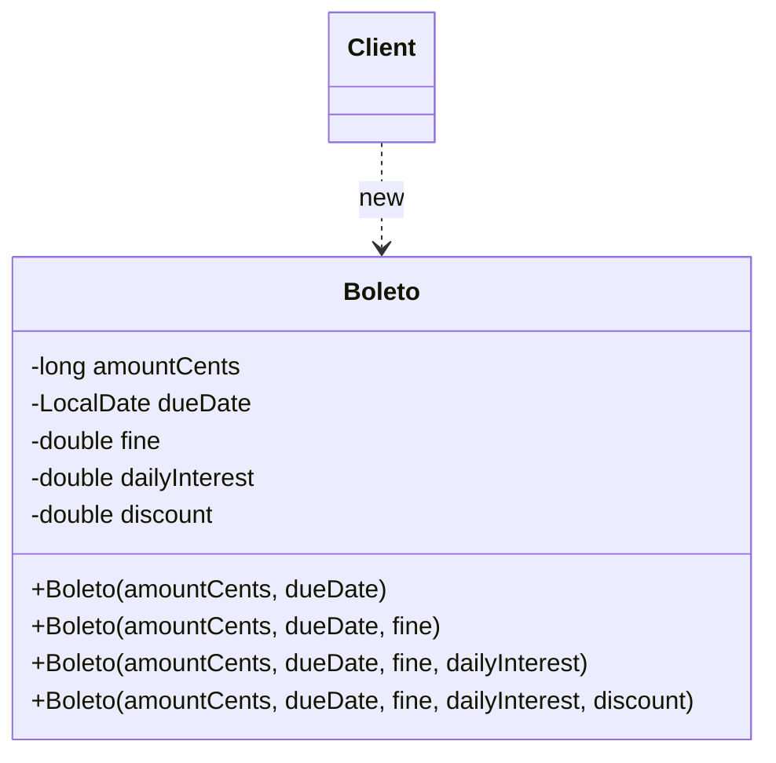

```mermaid
classDiagram
    class Client
    class Boleto {
        -long amountCents
        -LocalDate dueDate
        -double fine
        -double dailyInterest
        -double discount
        +Boleto(amountCents, dueDate)
        +Boleto(amountCents, dueDate, fine)
        +Boleto(amountCents, dueDate, fine, dailyInterest)
        +Boleto(amountCents, dueDate, fine, dailyInterest, discount)
    }
    Client ..> Boleto : new
```
