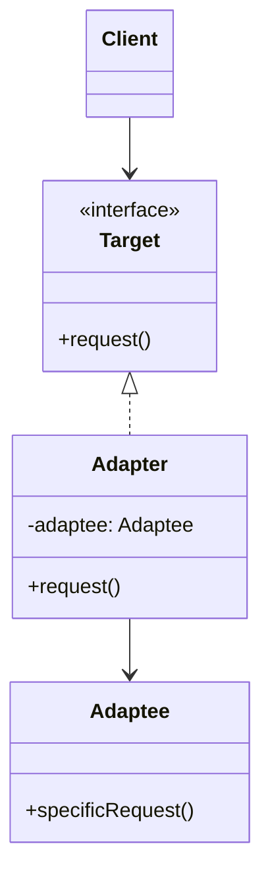

```mermaid
classDiagram
    class Client
    class Target {
        <<interface>>
        +request()
    }
    class Adapter {
        -adaptee: Adaptee
        +request()
    }
    class Adaptee {
        +specificRequest()
    }
    Client --> Target
    Target <|.. Adapter
    Adapter --> Adaptee
```
