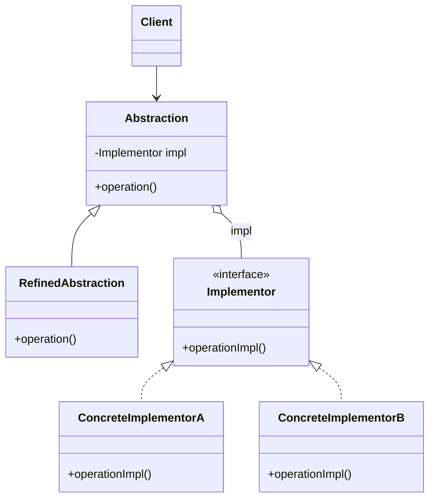

```mermaid
classDiagram
    class Abstraction {
        -Implementor impl
        +operation()
    }
    class RefinedAbstraction {
        +operation()
    }
    class Implementor {
        <<interface>>
        +operationImpl()
    }
    class ConcreteImplementorA {
        +operationImpl()
    }
    class ConcreteImplementorB {
        +operationImpl()
    }
    class Client
    Client --> Abstraction
    Abstraction <|-- RefinedAbstraction
    Abstraction o-- Implementor : impl
    Implementor <|.. ConcreteImplementorA
    Implementor <|.. ConcreteImplementorB
```
