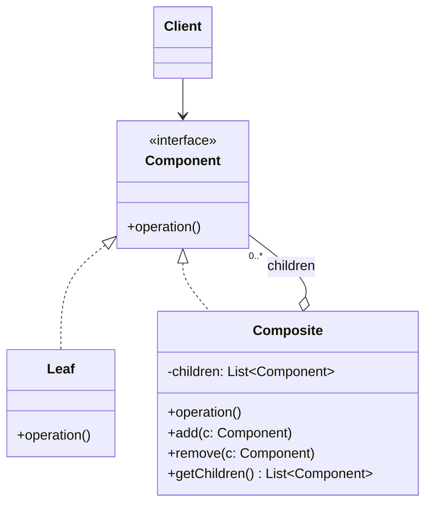

```mermaid
classDiagram
    class Client
    class Component {
        <<interface>>
        +operation()
    }
    class Leaf {
        +operation()
    }
    class Composite {
        -children: List~Component~
        +operation()
        +add(c: Component)
        +remove(c: Component)
        +getChildren() List~Component~
    }
    Client --> Component
    Component <|.. Leaf
    Component <|.. Composite
    Composite o-- "0..*" Component : children
```
