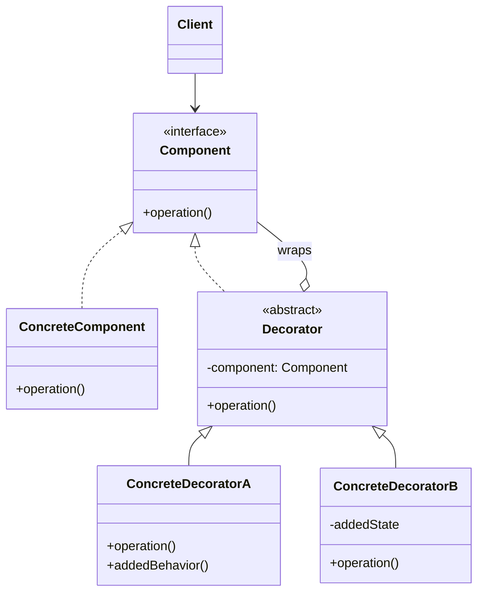

```mermaid
classDiagram
    class Component {
        <<interface>>
        +operation()
    }
    class ConcreteComponent {
        +operation()
    }
    class Decorator {
        <<abstract>>
        -component: Component
        +operation()
    }
    class ConcreteDecoratorA {
        +operation()
        +addedBehavior()
    }
    class ConcreteDecoratorB {
        -addedState
        +operation()
    }
    class Client
    Component <|.. ConcreteComponent
    Component <|.. Decorator
    Decorator o-- Component : wraps
    Decorator <|-- ConcreteDecoratorA
    Decorator <|-- ConcreteDecoratorB
    Client --> Component
```
