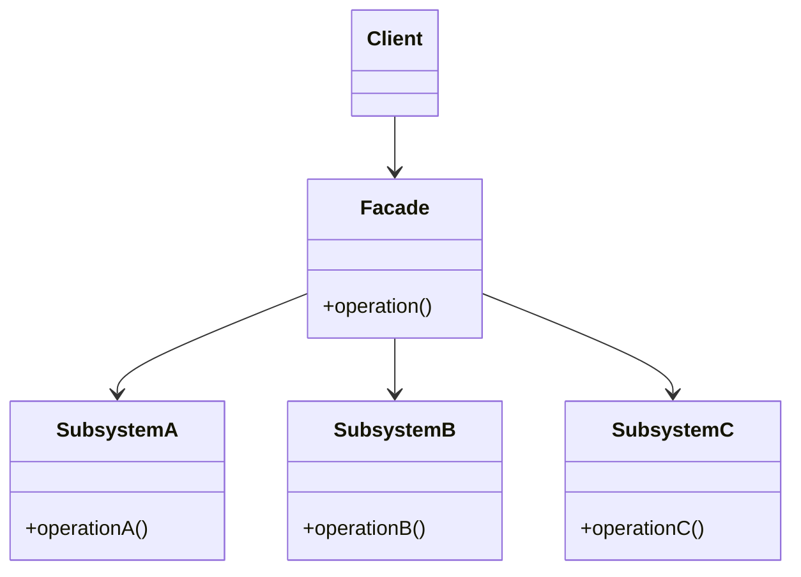

```mermaid
classDiagram
    class Client
    class Facade {
        +operation()
    }
    class SubsystemA {
        +operationA()
    }
    class SubsystemB {
        +operationB()
    }
    class SubsystemC {
        +operationC()
    }
    Client --> Facade
    Facade --> SubsystemA
    Facade --> SubsystemB
    Facade --> SubsystemC
```
