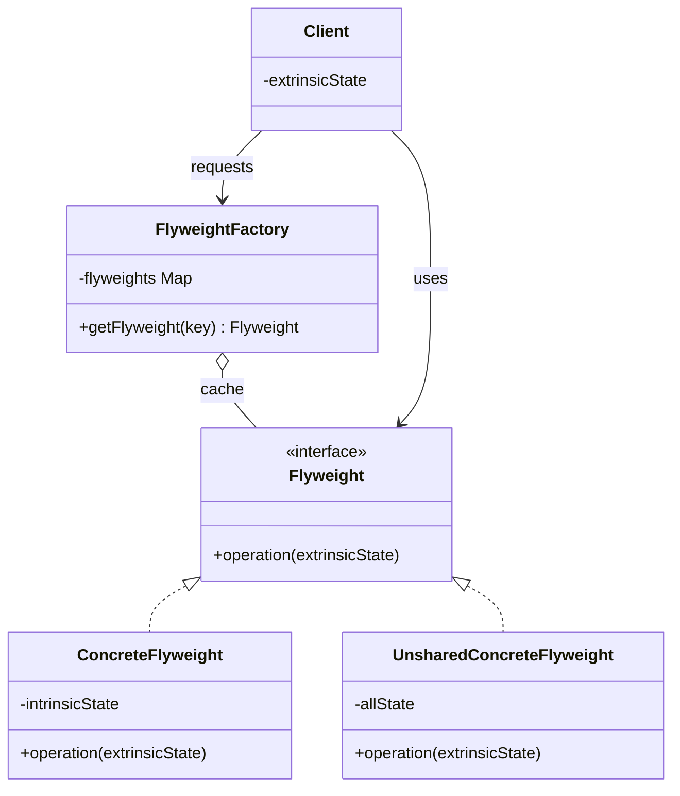

```mermaid
classDiagram
    class Flyweight {
        <<interface>>
        +operation(extrinsicState)
    }
    class ConcreteFlyweight {
        -intrinsicState
        +operation(extrinsicState)
    }
    class UnsharedConcreteFlyweight {
        -allState
        +operation(extrinsicState)
    }
    class FlyweightFactory {
        -flyweights Map
        +getFlyweight(key) Flyweight
    }
    class Client {
        -extrinsicState
    }
    Flyweight <|.. ConcreteFlyweight
    Flyweight <|.. UnsharedConcreteFlyweight
    FlyweightFactory o-- Flyweight : cache
    Client --> FlyweightFactory : requests
    Client --> Flyweight : uses
```
