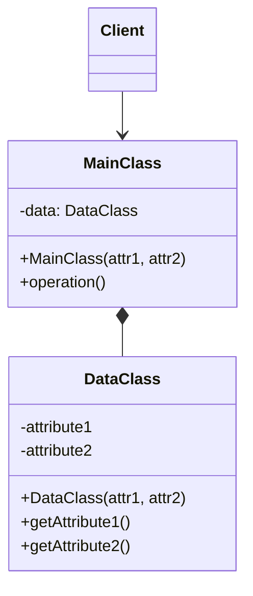

```mermaid
classDiagram
    class Client
    class MainClass {
        -data: DataClass
        +MainClass(attr1, attr2)
        +operation()
    }
    class DataClass {
        -attribute1
        -attribute2
        +DataClass(attr1, attr2)
        +getAttribute1()
        +getAttribute2()
    }
    Client --> MainClass
    MainClass *-- DataClass
```
