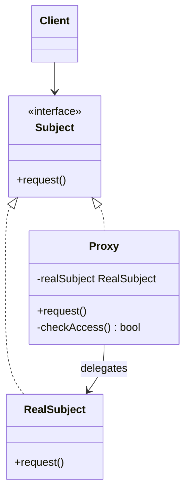

```mermaid
classDiagram
    class Client
    class Subject {
        <<interface>>
        +request()
    }
    class RealSubject {
        +request()
    }
    class Proxy {
        -realSubject RealSubject
        +request()
        -checkAccess() bool
    }
    Client --> Subject
    Subject <|.. RealSubject
    Subject <|.. Proxy
    Proxy --> RealSubject : delegates
```
