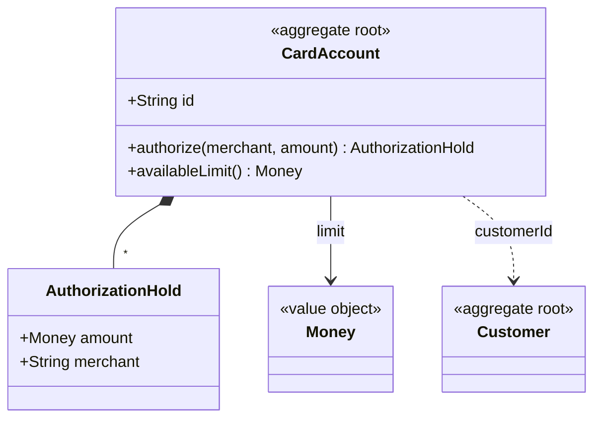

```mermaid
classDiagram
    class CardAccount {
        <<aggregate root>>
        +String id
        +authorize(merchant, amount) AuthorizationHold
        +availableLimit() Money
    }
    class AuthorizationHold {
        +Money amount
        +String merchant
    }
    class Money {
        <<value object>>
    }
    class Customer {
        <<aggregate root>>
    }
    CardAccount "1" *-- "*" AuthorizationHold
    CardAccount --> Money : limit
    CardAccount ..> Customer : customerId
```
