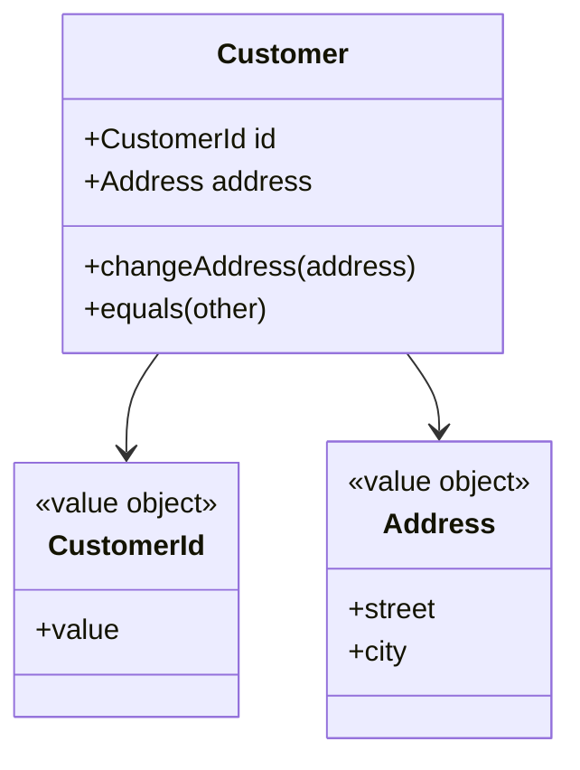

```mermaid
classDiagram
    class Customer {
        +CustomerId id
        +Address address
        +changeAddress(address)
        +equals(other)
    }
    class CustomerId {
        <<value object>>
        +value
    }
    class Address {
        <<value object>>
        +street
        +city
    }
    Customer --> CustomerId
    Customer --> Address
```
