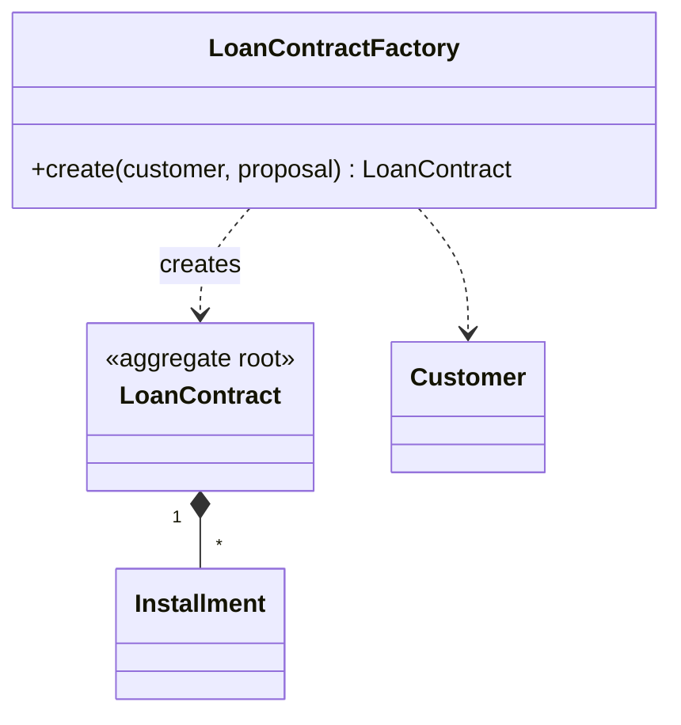

```mermaid
classDiagram
    class LoanContractFactory {
        +create(customer, proposal) LoanContract
    }
    class LoanContract {
        <<aggregate root>>
    }
    class Installment
    class Customer
    LoanContractFactory ..> LoanContract : creates
    LoanContractFactory ..> Customer
    LoanContract "1" *-- "*" Installment
```
